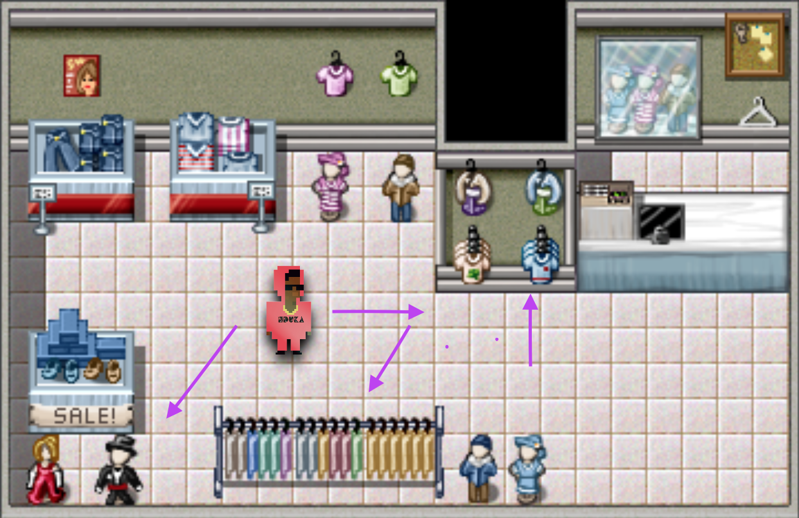

# RAG-O-RAMA - FIND YOUR NDUKA MERCH - GAME PITCH

## What's the game about?

Welcome to Rag-O-Rama! We're your neighborhood virtual thrifting gold mine. Our friend NDUKATHECHIEF stopped by and dropped off some unreleased merch pieces from his upcoming tour. Instead of the usual front of store display, we've scattered each piece throughout the store. However many you collect, you keep! Forgive our pet, Leo the leopard. He doesn't bite, I promise...just to be sure, you probably should put a bit of pep in your step 😅. 

You never know, if you can collect all the merch pieces, Leo just may decide to be your friend. Get to rummaging 😎.

## Tech stack

- Vanilla HTML, JS, and CSS
- HTML5 Canvas

## Wireframes

## MVP Goals

- Create a movable player character
- Let character jump
- Create obstacles/clues to hide merch pieces
- A goal that once all the pieces are collected ends the game
- Make a game timer 
- A reset button

## Stretch Goals

- Add obstacles
  - Make leopard character chase the avatar
  - Create riddles to solve to unlock each merch piece
  - A treadmill moving in the opposite direction of desired travel
- Animated sprites
- Play background music
- Extra collectibles to collect along the way

## Potential Roadblocks

- Not getting to caught up in design aesthetics that I don't solve the game functionality
- Making this have a smooth movement pattern
- Figuring out how to make the leopard randomly come into frame
- Jumping over obstacles - not sure where to start